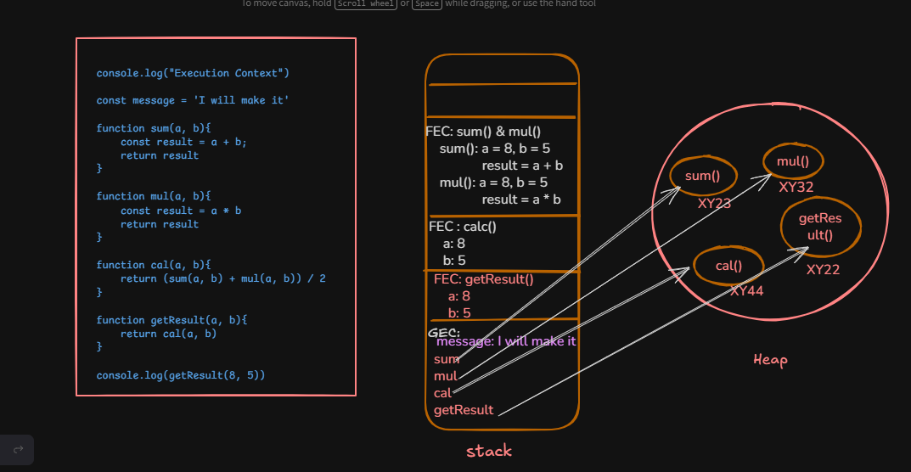
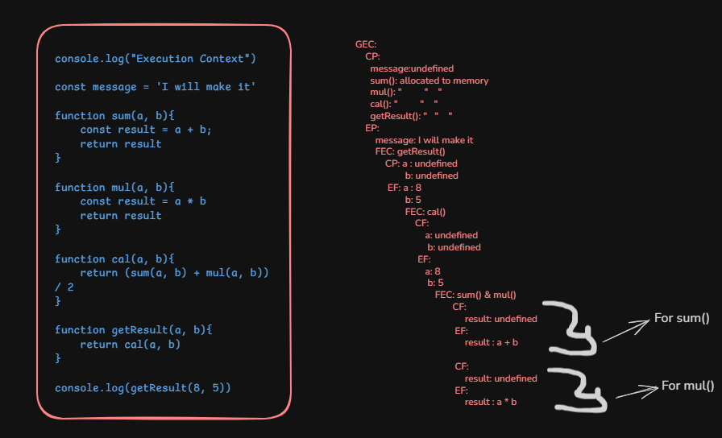
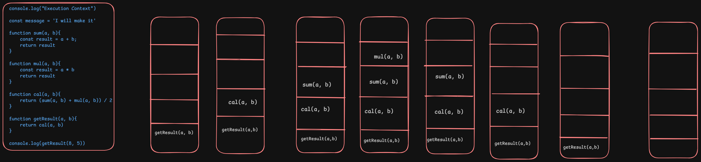

## Explain the execution context of these code

```js
console.log("Execution Context")

const message = 'I will make it'

function sum(a, b){
    const result = a + b;
    return result
}

function mul(a, b){
    const result = a * b
    return result
}

function cal(a, b){
    return (sum(a, b) + mul(a, b)) / 2
}

function getResult(a, b){
    return cal(a, b)
}

console.log(getResult(8, 5))

```

## Stack and Heap flow diagram



## GEC and FEC with CF and EF 


## The Stack Diagram

